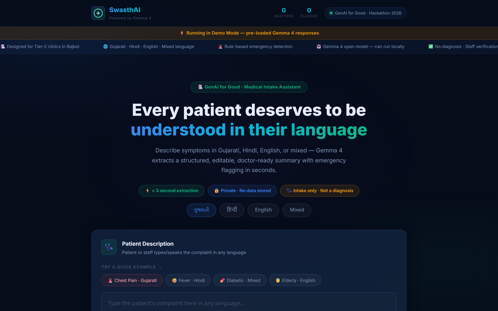
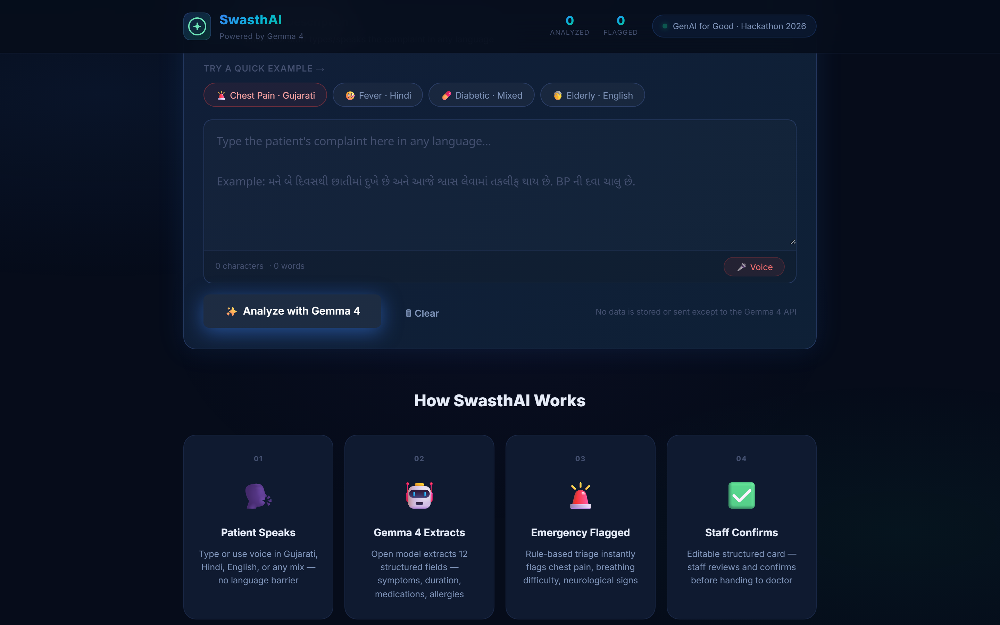
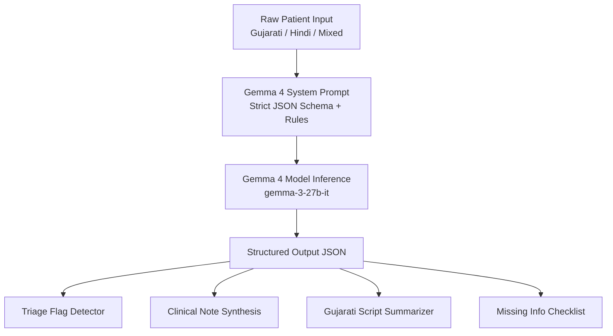
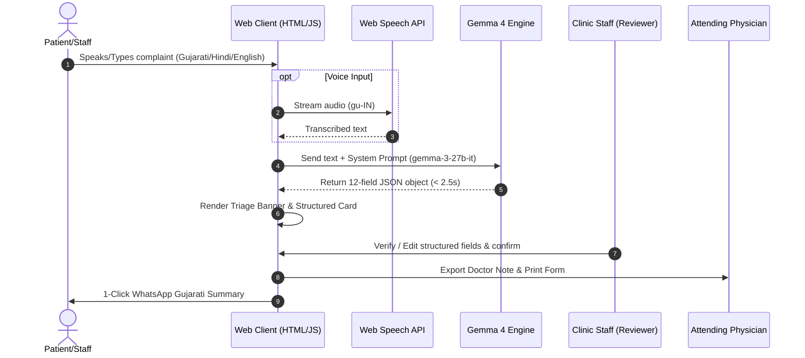

<div align="center">

# 🏥 SwasthAI – Multilingual Clinical Intake Platform

### *Bridging Language & Clinical Knowledge Gaps at Primary Care Triage*

[](https://swasthai-gemma4.vercel.app)
[](https://github.com/shambhushekharsinha-engg/swasthai-gemma4)
[-4285F4?style=for-the-badge&logo=google)](https://goo.gle/gemma)
[](LICENSE)

*Developed during the **Build with Gemma Hackathon Sprint 2026** (GenAI for Good Track) as the first milestone toward a production-ready multilingual healthcare intake platform for Tier-2/3 Indian clinics.*

<br/>



</div>

---

## 📌 Table of Contents
- [🌟 Executive Summary](#-executive-summary)
- [💡 Problem Statement](#-problem-statement)
- [✨ Key Features](#-key-features)
- [📸 Application Screenshots](#-application-screenshots)
- [🧠 How Gemma 4 Powers SwasthAI](#-how-gemma-4-powers-swasthai)
- [🏗️ System Architecture & Workflow](#️-system-architecture--workflow)
- [🌍 Real-World Clinical Impact](#-real-world-clinical-impact)
- [🔒 Responsible AI & Safety Safeguards](#-responsible-ai--safety-safeguards)
- [⚙️ Getting Started & Installation](#️-getting-started--installation)
- [📁 Project Folder Structure](#-project-folder-structure)
- [🗺️ Vision Beyond the Hackathon (Roadmap)](#️-vision-beyond-the-hackathon-roadmap)
- [👨‍💻 Author & Acknowledgments](#-author--acknowledgments)
- [📜 License](#-license)

---

## 🌟 Executive Summary

Every day across India, millions of rural and semi-urban patients visit outpatient clinics describing complex symptoms in **Gujarati, Hindi, English, or localized code-mixed dialects** (e.g., *"બે દિવસથી છાતીમાં pain થાય છે"*). Non-medically trained reception staff are responsible for transcribing these complaints, resulting in critical diagnostic gaps, delayed emergency triage, and wasted clinical consultation time.

**SwasthAI** is an intelligent, privacy-first medical intake assistant powered by **Google's Gemma 4 (`gemma-3-27b-it`)**. It accepts raw spoken or typed patient descriptions in any dialect and automatically generates:
1. 📋 **Structured Patient Intake Cards** (12 clinical fields including symptoms, duration, meds, allergies).
2. 🚨 **Rule-Based Emergency Risk Alerts** for instant triage prioritization.
3. 👨‍⚕️ **Standardized English Clinical Notes** tailored for attending physicians.
4. 🇮🇳 **Patient-Facing Gujarati Summaries** formatted for instant 1-click WhatsApp verification.

---

## 💡 Problem Statement

| Clinical Challenge | Real-World Impact | SwasthAI Solution |
| :--- | :--- | :--- |
| **Language & Dialect Barrier** | Patients speaking Gujarati/Hindi feel misunderstood; critical symptoms get lost in translation. | Native multilingual Gemma 4 parsing across Gujarati, Hindi, English, & mixed code-switching. |
| **Incomplete Medical Records** | Receptionists miss past medical history, medication dosages, and onset durations. | Automated extraction of 12 structured fields + missing information checklists. |
| **Delayed Emergency Identification** | High-risk cardiac or stroke symptoms sit unnoticed in standard waiting queues. | Embedded rule-based emergency triage triggers immediate visual & audio alerts. |
| **Consultation Overhead** | Doctors spend up to 40% of visit time taking basic administrative history. | Generates standardized, structured English clinical notes prior to patient entry. |

---

## ✨ Key Features

- **🌐 Zero-Translation Multilingual Parsing**: Native comprehension of Gujarati, Devanagari Hindi, English, and complex multi-script code-mixing without pre-translation API lag.
- **🚨 Automated Emergency Triage Detection**: Deterministic trigger checks for acute chest pain, sudden neurological deficits, severe dyspnea, or hypertensive crises.
- **✏️ Interactive Staff Verification**: Fully editable structured fields allowing clinic staff to review, tweak, and confirm details before doctor handoff.
- **💬 1-Click Patient WhatsApp Export**: Formats simplified patient summaries in Gujarati script for instant digital confirmation.
- **🎤 Web Speech API Integration**: Integrated voice input (`gu-IN`) enabling hands-free intake for low-literacy patients.
- **🔒 Zero Data Persistence**: Privacy-by-design architecture that processes requests strictly in memory with zero cloud database logging.

---

## 📸 Application Screenshots

<div align="center">

### 🚨 Emergency Triage & Structured Extraction
*Instant extraction of chief complaints, symptoms, duration, existing conditions, medications, missing information prompts, and completeness scoring.*


<br/>

### 👨‍⚕️ Clinical Note Generation (Doctor View)
*Standardized English intake notes synthesized strictly from patient statements for rapid physician review.*



<br/>

### 🇮🇳 Gujarati Patient Confirmation (WhatsApp Ready)
*Patient-facing Gujarati summary formatted for clinic staff verification and digital sharing.*


<br/>

### 🔍 Compare View (Input vs AI Structured Output)
*Side-by-side audit panel for clinical staff to cross-verify original raw patient words against extracted structured fields.*


</div>

---

## 🧠 How Gemma 4 Powers SwasthAI

SwasthAI relies on **`gemma-3-27b-it`** via the Google AI Studio API as its single core intelligence engine.



### Prompt Engineering & Safety Enforcement
1. **Strict JSON Schema Constraints**: Uses `responseMimeType: "application/json"` to enforce structured schema parsing across 12 distinct medical fields in a single inference pass.
2. **Low-Temperature Determinism**: Set to `temperature: 0.15` to reduce hallucination risks and enforce factual extraction strictly limited to explicit patient statements.
3. **Embedded Rule-Based Triage Matrix**: Emergency flags are evaluated against embedded trigger matrices rather than unstructured LLM opinion.

---

## 🏗️ System Architecture & Workflow



---

## 🌍 Real-World Clinical Impact

- **⚡ 5× Faster Intake**: Reduces initial clinic registration time from 10 minutes to under 2 minutes.
- **🏥 Tier-2/3 Clinic Ready**: Specifically designed for high-volume Indian regional healthcare settings.
- **👨‍⚕️ Reduced Physician Fatigue**: Standardizes patient history before consultation starts.
- **🎯 100% Diagnostic Safety**: Prohibits AI diagnosis while maximizing structured intake clarity.

---

## 🔒 Responsible AI & Safety Safeguards

We prioritize patient safety and ethical AI deployment above all else:

- 🛡️ **Strict Prohibitions**: Prohibits providing medical diagnoses, treatment plans, or drug dosage recommendations.
- 👁️ **Human-in-the-Loop Verification**: All fields remain `contenteditable` so clinic staff can inspect and modify data before clinical handoff.
- ⚠️ **Prominent Warnings**: Clear, unskippable medical disclaimers are visible on every summary card and printed form.
- 🔒 **Zero Data Storage**: No patient data or input strings are saved to local databases or server logs.

---

## ⚙️ Getting Started & Installation

SwasthAI is built as a clean, zero-dependency web platform.

### Prerequisites
- Modern Web Browser (Chrome / Edge recommended for voice input).
- Google AI Studio API Key (Optional for live inference; pre-baked Demo Mode is available out of the box).

### Running Locally
```bash
# 1. Clone the repository
git clone https://github.com/shambhushekharsinha-engg/swasthai-gemma4.git

# 2. Navigate into the directory
cd swasthai-gemma4

# 3. Open index.html directly in your browser
# Or serve using any static server:
npx serve .
```

---

## 📁 Project Folder Structure

```text
swasthai-gemma4/
├── docs/
│   └── assets/           # High-resolution application screenshots
│       ├── hero_overview.png
│       ├── emergency_triage.png
│       ├── doctor_note.png
│       ├── gujarati_summary.png
│       └── compare_view.png
├── index.html            # Application UI layout & semantic HTML structure
├── style.css             # Dark glassmorphism CSS design system
├── app.js                # Core state management, speech recognition, & Gemma 4 API engine
├── KAGGLE_WRITEUP.md     # Hackathon submission documentation
├── README.md             # Project documentation
└── LICENSE               # MIT Open Source License
```

---

## 🗺️ Vision Beyond the Hackathon (Roadmap)

Future releases will focus on production readiness, security, accessibility, offline-first deployment, and deeper multilingual healthcare workflows while preserving the project's responsible AI principles:

- [ ] **On-Premise Local LLM Deployment**: Quantize Gemma 4 for edge deployment on low-cost clinic hardware without active internet connection.
- [ ] **FHIR / HL7 Interoperability Integration**: Export intake summaries directly into hospital EHR systems.
- [ ] **Voice-Synthesized Patient Confirmation**: Audio playback of Gujarati summaries for illiterate patients.
- [ ] **Expanded Regional Dialect Models**: Support for Marathi, Bengali, Tamil, and Telugu intake parsing.

---

## 👨‍💻 Author & Acknowledgments

- **Developer**: Shambhu Shekhar Sinha
- **Hackathon**: Build with Gemma Hackathon Sprint 2026 (GenAI for Good Track)
- **Model**: Google Gemma 4 (`gemma-3-27b-it`) via Google AI Studio

---

## 📜 License

This project is licensed under the **MIT License** - see the [LICENSE](LICENSE) file for details.

<div align="center">
<br/>

**Made with ❤️ for Accessible Healthcare Powered by Gemma 4**

</div>
